# 🎭 Vibe Templates - README

## 📖 Cos'è il Vibe Coding?

Il **Vibe Coding** è un approccio strutturato allo sviluppo che usa template in Markdown per:

- Pianificare prima di codificare
- Mantenere coerenza nei progetti
- Facilitare la collaborazione con GitHub Copilot
- Documentare decisioni e rationale

## 📁 Template Disponibili

### 🚀 `template-progetto.md`

**Quando usarlo**: Inizio di nuovo progetto o feature principale
**Contenuto**: Obiettivi, requisiti, architettura, vincoli

```bash
# Workflow
1. Copia il template
2. Rinomina: `progetto-[nome-feature].md`
3. Compila le sezioni
4. Usa Copilot per completare/raffinare
5. Genera codice dalla specifica completa
```

### 🔧 `template-refactor.md`

**Quando usarlo**: Refactoring significativo di codice esistente
**Contenuto**: Analisi problemi, piano step-by-step, metriche successo

```bash
# Workflow
1. Analizza codice esistente con /explain
2. Compila template con problemi identificati
3. Pianifica refactoring incrementale
4. Usa /refactor e /optimize per suggerimenti
5. Applica modifiche step-by-step
```

### 🧪 `template-tests.md`

**Quando usarlo**: Aggiunta test suite o test complex
**Contenuto**: Scenari test, mock strategy, coverage goals

```bash
# Workflow
1. Seleziona codice da testare
2. Usa /tests per generazione base
3. Compila template per casi complessi
4. Implementa test mancanti
5. Verifica coverage target
```

### 📝 `template-commit.md`

**Quando usarlo**: Commit importanti con molte modifiche
**Contenuto**: Analisi modifiche, impatto, messaggio strutturato

```bash
# Workflow
1. Esegui git status/diff
2. Usa /commitmessage per bozza
3. Compila template per commit complessi
4. Genera messaggio finale conventional
5. Commit con messaggio strutturato
```

## 🎯 Come Usare i Template

### 1. Preparazione

```bash
# Copia il template pertinente
cp .vibe/template-progetto.md .vibe/progetto-login-system.md

# Apri in VS Code
code .vibe/progetto-login-system.md
```

### 2. Compilazione Guidata

- **Anteprima**: `Ctrl/Cmd+Shift+V` per preview markdown
- **Copilot Inline**: `Ctrl/Cmd+I` su sezioni da completare
- **Chat Copilot**: `Ctrl/Cmd+Shift+I` per brainstorming

### 3. Generazione Codice

```bash
# Seleziona sezioni del template
# Invia a Copilot Chat: "Genera codice TypeScript basato su questa specifica"
# Rivedi e applica suggerimenti
```

### 4. Iterazione

- Aggiorna template durante sviluppo
- Mantieni sincronizzazione codice ↔ specifica
- Usa per onboarding nuovi dev

## 💡 Best Practices

### ✅ DO

- Compila SEMPRE i template prima di codificare
- Usa linguaggio specifico e misurabile
- Includi esempi e casi limite
- Mantieni template aggiornati
- Condividi template tra team members

### ❌ DON'T

- Non saltare la fase di pianificazione
- Non lasciare sezioni vuote senza motivazione
- Non copiare template senza personalizzare
- Non ignorare i vincoli identificati
- Non dimenticare di aggiornare durante sviluppo

## 🔄 Workflow Completo

```mermaid
graph TD
    A[📋 Nuovo Task] --> B[🎯 Scegli Template]
    B --> C[✏️ Compila Template]
    C --> D[🤖 Copilot Review]
    D --> E[💻 Genera Codice]
    E --> F[🧪 Implementa Test]
    F --> G[📝 Commit Strutturato]
    G --> H[🔄 Aggiorna Template]
    H --> I[✅ Task Complete]
```



## 🚀 Template Personalizzati

Crea i tuoi template seguendo questa struttura:

```markdown
# Template Nome

## 🎯 Obiettivo

Quando e perché usare questo template

## 📋 Sezioni

### Sezione 1

- Campi da compilare
- Esempi

### Sezione 2

- Altri campi
- Checklist

## 💻 Esempi

Codice/output atteso

## 📝 Note

Best practices specifiche

---

**Istruzioni d'uso**:
Step-by-step workflow
```

## 🎪 Playground Examples

Nel progetto trovi esempi pratici:

```bash
# Crea un nuovo componente
cp .vibe/template-progetto.md .vibe/componente-calculator.md
# Compila obiettivi, UI requirements, logic
# Usa Copilot per generare React component

# Refactor componente esistente
cp .vibe/template-refactor.md .vibe/refactor-example-component.md
# Analizza ExampleComponent.tsx
# Pianifica miglioramenti
# Applica refactoring guidato

# Aggiungi test
cp .vibe/template-tests.md .vibe/test-calculator.md
# Specifica test cases
# Genera test suite con Copilot
```

## 🎉 Prossimi Passi

1. **Esplora**: Apri ogni template e leggi le sezioni
2. **Sperimenta**: Crea un piccolo progetto usando `template-progetto.md`
3. **Refactoring**: Migliora `ExampleComponent.tsx` con `template-refactor.md`
4. **Testing**: Aggiungi test usando `template-tests.md`
5. **Commit**: Usa `template-commit.md` per commit strutturati

**Happy Vibe Coding! 🚀**
